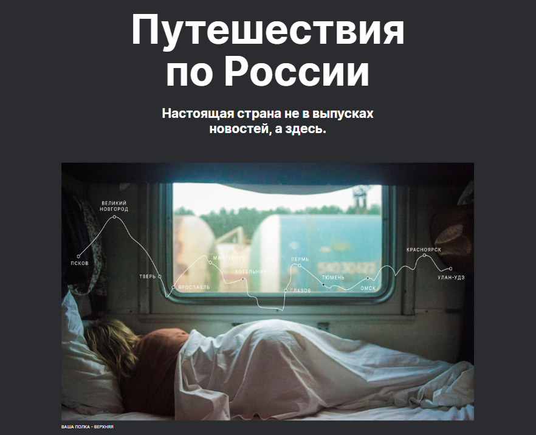
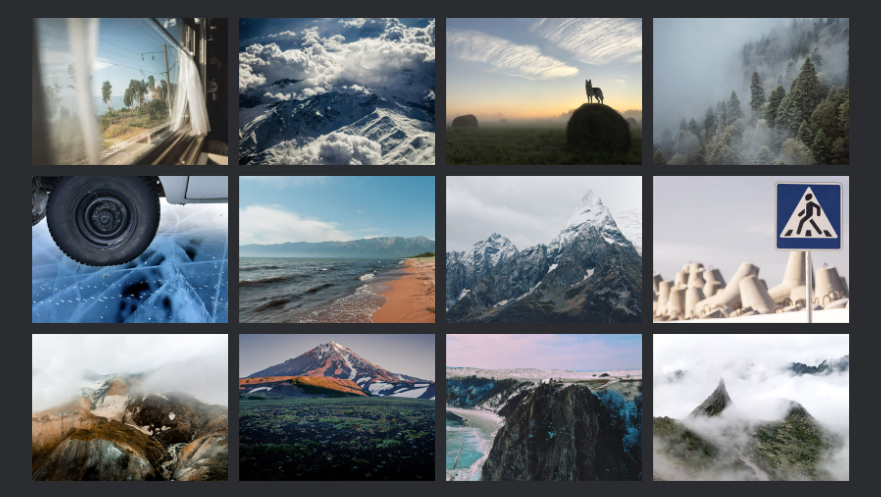
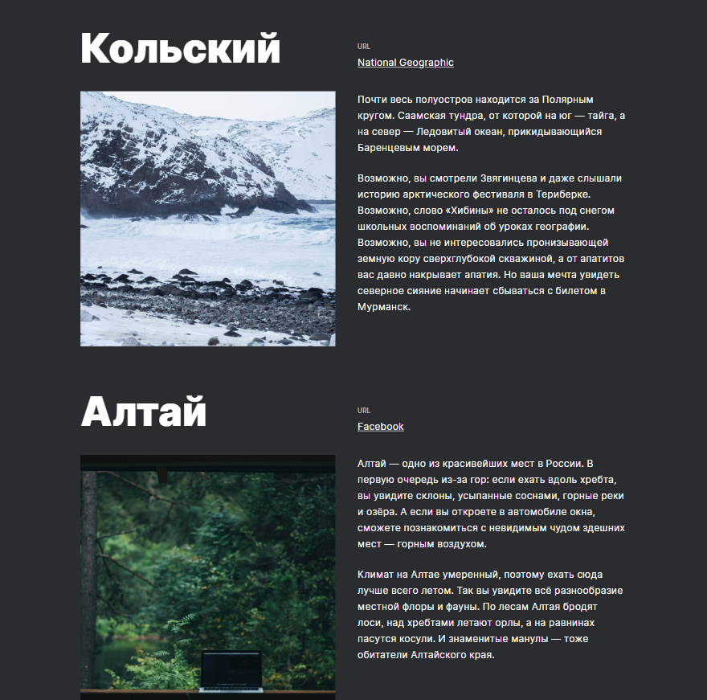

# Путешествия по России 
Практическая работа третьего спринта курса Яндекс Практикума по веб-разработке. Сайт, рассказывающий о красоте Российских просторов и интересных местах, где можно побывать.

## Функционал
* Адаптивность на любых устройствах
* Изменение количества контента с минимальным редактированием кода сайта
* Интерактивность ссылок

## Технологии
* HTML
* CSS
* Позиционирование элементов
* Псевдоэлементы и псевдоклассы
* Методолгоия БЭМ
* Flexbox
* Grid Layout

