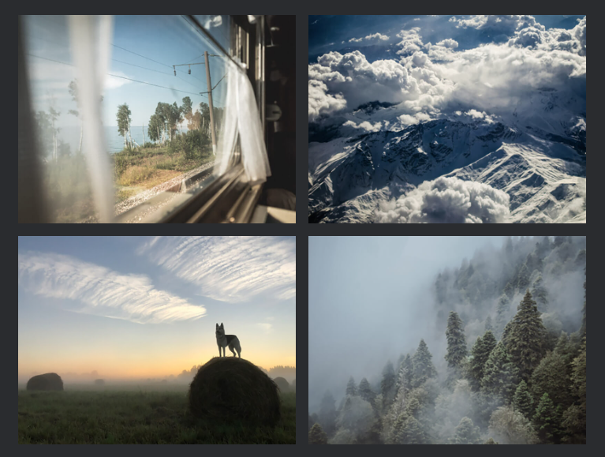

# Путешествия по России 
Практическая работа третьего спринта курса Яндекс Практикума по веб-разработке. Сайт, рассказывающий о красоте Российских просторов и интересных местах, где можно провести отпуск.

[Ссылка на сайт в интернете](https://memladna.github.io/project-sprint3/)

## Функционал
* Адаптивность на любых устройствах
* Изменение количества контента с минимальным редактированием кода сайта
* Интерактивность ссылок

## Технологии
* HTML
* CSS
* Позиционирование элементов
* Псевдоэлементы и псевдоклассы
* Методолгоия БЭМ
* Flexbox
* Grid Layout

## Адаптивность
* 1280px

* 1024px

* 768px
